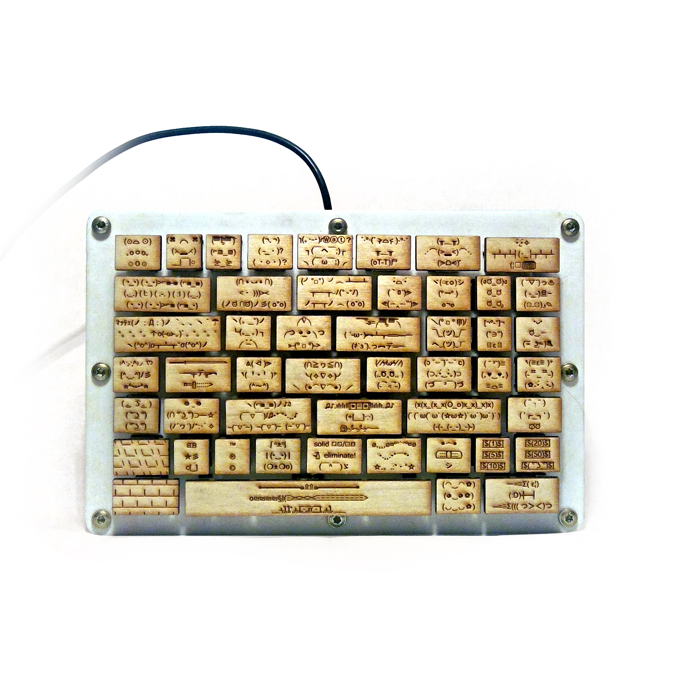
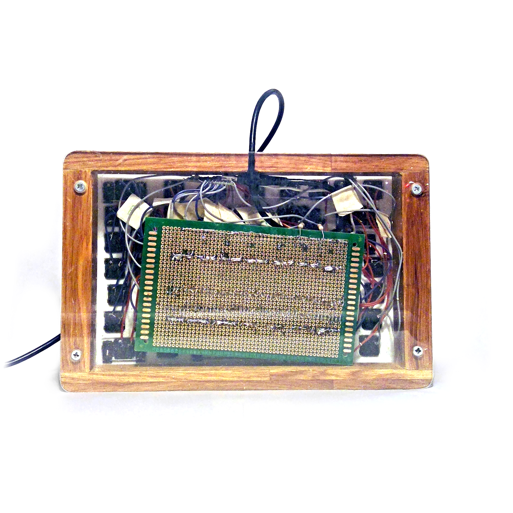

# Emoticon Keyboard (͠≖ ͜ʖ͠≖)👌

</img> </img>

Most of my projects start with an impulse of some kind. Two years ago I decided I liked emoticons so much that I was going to make a keyboard just for emoticons. Although I could just have used another keyboard with a bunch of macros I was feeling ambitious and wanted to build it all by hand from the ground up. This is my first real introduction to hardware of any kind, and my first finished project.

Pressing a button on the keyboard causes the client program to load the corresponding emoticon and paste it while also reloading previous clipboard data. The emoticon that is displayed at the top  

### My process went (roughly) like this:
+ Research into what materials I need. (checking if I could afford it)
+ Testing how to program an arduino to write emoticons such as “【・_・?】” (it took my a while to learn about the input protocols)
+ Write the teensy code and client code. Dove into C and HID protocols.
+ Once that worked, I made the plate for the Cherry MX keys to fit. There were many complications to this part including how to convert 3D types in Maya, Plastic warping, and getting the keys to fit into the rough print from the school printer. 
+ From there I worked on the wooden frame and acrylic panel which took multiple iterations until it looked right.
+ Hand wired the matrix input into the teensy. A lot of work could have been avoided with a pcb, but I was trying to be as cheap as possible.
+ At NYU after a semester of trial and error I found the right dimensions for a key connector that could be resin printed.
+ Sigh of relief as this 3 year project is finally over. (º﹃º ) ᕕ( ᐛ )ᕗ

### Some helpful tools I used:
+ [Custom key layout editor](http://www.keyboard-layout-editor.com/#/gists/4f1dd0537481beda3158)
+ [Backplate creator (uses layout data)](http://builder.swillkb.com/)

### Additional Pictures:
</img> </img> </img> 
 
### Other:
+ [Reddit post](https://www.reddit.com/r/MechanicalKeyboards/comments/8l0nvm/kind_of_silly_but_here_is_an_emoticon_keyboard_i/)
